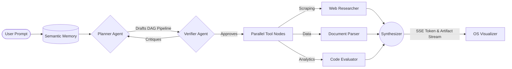

<div align="center">
  <br />
  
  <h1 align="center" style="font-size: 3rem; font-weight: 800; letter-spacing: -1px;">DualMind OS</h1>
  <p align="center">
    <strong>A next-generation autonomous AI Operating System with cinematic multi-agent orchestration.</strong>
  </p>
  
  <p align="center">
    <a href="https://dualmind-ai.web.app"></a>
    
    
    
  </p>
  
  <p align="center">
    <a href="#-cinematic-introduction">Vision</a> •
    <a href="#-the-workspace-experience">Workspace</a> •
    <a href="#-autonomous-orchestration-dag">Architecture</a> •
    <a href="#-artifact-subsystem">Artifacts</a> •
    <a href="#-deployment">Deployment</a>
  </p>
  <br />
</div>

> **DualMind is not another chatbot wrapper.** It is a fully persistent, high-performance intelligence environment. DualMind replaces linear prompt-response paradigms with a dynamic, multi-agent workspace that autonomously plans, researches, verifies, and generates premium deliverables in real time.

<div align="center">
  <!-- PRIMARY SHOWCASE: Workspace with active DAG Orchestration -->
  <a href="https://dualmind-ai.web.app">
    
  </a>
  <p><i>The DualMind OS Workspace • Live Neural Execution & Artifact Generation</i></p>
</div>

---

## 🌌 Cinematic Introduction

DualMind represents a structural shift in human-AI interaction. Built for executives, AI researchers, and engineers, it drops you into a **persistent semantic workspace** where intelligence is orchestrated rather than just queried. 

The system utilizes an advanced **Directed Acyclic Graph (DAG) Execution Engine** powered by parallel AI workers. Instead of guessing answers, the intelligence layer dynamically drafts execution pipelines, critiques its own logic using an adversarial verifier, retrieves realtime contextual data, and streams the compiled insights directly to a cinematic visualizer.

**This is an AI Operating System.** It breathes, reacts to computational load, remembers past workflows, and presents polished, interactive research artifacts.

---

## 🖥️ Visual Showcase & OS Features

### 1. Workspace Split-Pane Interface
DualMind strips away friction, replacing simple chat columns with a professional **Split-Pane OS Layout**. The left pane acts as the command and streaming interface, while the right pane automatically expands into a massive, live topological view of your requested intelligence processes.
*(Visuals: fluid drag-to-resize handles, active glow states, and an ultra-modern dark UI.)*

### 2. Live DAG Orchestration (Neural Execution)
We discarded generic flowchart plugins. DualMind features a custom, GPU-accelerated **Cinematic DAG Visualizer**. As the intelligence orchestrator spawns background workers, you watch the execution graph build itself in realtime.
* See the exact dependencies of parallel execution nodes.
* Watch animated SVG execution beams traverse the network.
* Observe nodes transition dynamically through `running`, `success`, and `error` states with deep neural glow effects.

### 3. Realtime Cognition Timeline
Stop guessing what the AI is thinking. The **Cognition Timeline** renders an expanding neural spine directly inline with your active stream. It captures every internal event—memory retrieval, adversarial verification critiques, confidence scoring, and tool invocation—translating the black box of LLM inference into an intelligible, beautiful visual log.

### 4. Claude-Style Artifact Subsystem
When complex data visualization, financial research, or executive intelligence is requested, DualMind automatically materializes an interactive **Artifact Viewer**.
* Sandboxed iframe environment safely executing generated HTML, Chart.js, and Mermaid graphs.
* Seamless fullscreen mode for distraction-free reading.
* Built-in 1-click **PDF and HTML exports** utilizing a graceful server-side `pdfkit`/HTML fallback system.

### 5. Semantic Memory & Replay
Conversations aren't lost in the void. DualMind utilizes **ChromaDB** and **Firestore** for deep semantic memory persistence. 
* Close the browser, return days later, and seamlessly resume orchestration pipelines.
* The replay system perfectly reconstructs your past workspaces, cognitive timelines, and generated artifacts.

---

## 🧠 Autonomous Orchestration (DAG)

Behind the cinematic frontend lies an advanced adversarial engine written in **FastAPI**, routing state-of-the-art inference through NVIDIA NIM and OpenRouter models.



---

## ⚡ Tech Stack & Performance

DualMind treats performance as a core feature. The frontend UI is immune to React render storms, utilizing custom `requestAnimationFrame` batching to ensure a silky-smooth **60 FPS** execution experience even during massive server-sent-event data dumps.

| Layer | Technology | Purpose |
|---|---|---|
| **Frontend UI** |   | Cinematic workspace layout, streaming markdown |
| **Animation/UX**|   | GPU-accelerated DAGs, SVG neural topologies |
| **State** |  | High-performance OS memory and timeline state |
| **Backend OS** |   | Async graph orchestration, dynamic PDF generation |
| **Database** |   | Semantic vector memory & global edge persistence |

---

## 🛠️ Local Development & Deployment

DualMind is production-hardened and deploy-ready out of the box.

### 1. Initialize Neural Workspace (Frontend)

```bash
git clone https://github.com/satvik2106/DualMind-ai.git
cd DualMind-ai/frontend_v2

npm install
npm run dev
```

### 2. Initialize Orchestration Engine (Backend)
Requires Python 3.11+.

```bash
cd ../
python -m venv venv
source venv/bin/activate  # On Windows: venv\Scripts\activate
pip install -r requirements.txt
python api_server.py
```

### 3. Environment Configuration

```env
# BACKEND (.env)
NVIDIA_API_KEY=your_nvidia_api_key
OPENROUTER_API_KEY=your_openrouter_api_key
FIREBASE_SERVICE_ACCOUNT_KEY={"type":"service_account"...}
ALLOWED_ORIGINS=http://localhost:3000,https://dualmind-ai.web.app

# FRONTEND (frontend_v2/.env.local)
NEXT_PUBLIC_API_URL=http://localhost:8000
NEXT_PUBLIC_FIREBASE_API_KEY=your_api_key
NEXT_PUBLIC_FIREBASE_PROJECT_ID=your_project_id
NEXT_PUBLIC_FIREBASE_APP_ID=your_app_id
```

### 4. Production Release
* **Frontend**: Deploy `frontend_v2` to Firebase Hosting or Vercel. Fully optimized static exports (`output: 'export'`) are already configured.
* **Backend**: Deploy the root to Render, Railway, or AWS. The artifact exporter is hardened to gracefully fallback from PDF to HTML if `wkhtmltopdf` binaries are missing in strict environments.

---

<div align="center">
  <p>Built with 🩵 by <a href="https://github.com/satvik2106">Satvik Vattipalli</a></p>
  <p><i>Welcome to the next generation of autonomous intelligence.</i></p>
</div>
