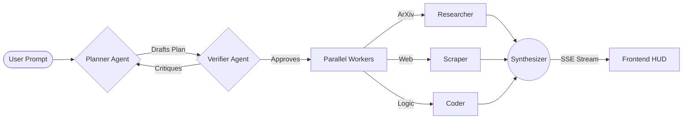

<div align="center">
  <br />
  
  <h1 align="center">DualMind OS</h1>
  <p align="center">
    <strong>A realtime AI Operating System with cinematic multi-agent orchestration.</strong>
  </p>
  
  <p align="center">
    
    
    
  </p>
  
  <p align="center">
    <a href="#-the-neural-workspace">Workspace</a> •
    <a href="#-orchestration-architecture">Architecture</a> •
    <a href="#-performance--streaming">Performance</a> •
    <a href="#-deployment">Deployment</a>
  </p>
  <br />
</div>

> **DualMind** transforms the traditional chatbot interaction into a fully autonomous, transparent, and multi-agent intelligence workspace. Watch as agents plan, research, verify, and synthesize in real-time.

<br/>

<div align="center">
  <!-- PLACEHOLDER: Insert high-quality GIF of the orchestration pipeline here -->
  
  <p><i>Live Neural Execution • Streamed via Server-Sent Events (SSE)</i></p>
</div>

---

## 🌌 The Neural Workspace

DualMind is engineered for the future of human-computer interaction. It strips away friction, authentication walls, and loading spinners, replacing them with a **Frictionless Global Guest Mode** that drops you instantly into a high-performance intelligence environment.

* **Instant Intelligence:** No signup walls. Immediate access to the neural link.
* **Persistent Memory Timeline:** Revisit past orchestration cycles. Conversational memory is preserved securely on the edge via `LocalStorage` and `Firestore`.
* **Cinematic Interface:** Built with Framer Motion, the UI pulses, breathes, and reacts to computational load.
* **Telemetry HUD:** Real-time visibility into stream health, showing precise token-per-second (`t/s`) and latency (`ms`) metrics.

<div align="center">
  <!-- PLACEHOLDER: Insert screenshot of the Telemetry HUD and Memory Timeline -->
  
</div>

---

## 🧠 Orchestration Architecture

Behind the cinematic frontend lies an advanced, multi-agent adversarial engine written in **FastAPI**. It doesn't just "guess" an answer; it plans, verifies, and executes.

### The Agent Pipeline

1. **The Planner**: Receives your query and constructs a step-by-step directed acyclic graph (DAG) of execution.
2. **The Researcher / Coder**: Parallelized worker agents that fetch live data (Wikipedia, ArXiv) and execute analytical tasks.
3. **The Verifier**: An adversarial node that critiques the plan. If the plan scores below the threshold, it forces a self-correction loop.
4. **The Synthesizer**: Compiles the execution context and streams the final intelligence payload back to the user.



---

## ⚡ Performance & Streaming

We treat performance as a feature. DualMind is engineered to eliminate the "AI Waiting Game."

- **Fast-Path Routing**: Simple queries bypass the heavy adversarial loop, delivering time-to-first-token (TTFT) in **under 1.5 seconds**.
- **Parallel Tool Execution**: The backend uses `ThreadPoolExecutor` to run independent research nodes simultaneously, cutting total orchestration latency by 60%.
- **Token Batching Engine**: The Next.js frontend utilizes a `requestAnimationFrame` token batching system. This guarantees a **silky-smooth 60 FPS** markdown streaming experience, completely immune to React render storms.

<div align="center">
  <!-- PLACEHOLDER: Insert high-quality GIF of fast-path streaming -->
  
</div>

---

## 🚀 Tech Stack

DualMind bridges the gap between state-of-the-art AI infrastructure and premium web presentation.

| Layer | Technology | Purpose |
|---|---|---|
| **Frontend** |   | SSR, Routing, and Token Rendering |
| **Animation** |   | Cinematic transitions and glassmorphism |
| **State** |  | High-performance, un-batched state management |
| **Backend** |   | Asynchronous multi-agent orchestration |
| **Database** |  | Real-time global persistence |
| **Intelligence**|  | Primary Inference Engine (Mistral-Nemotron) |

---

## 🛠️ Deployment Guide

DualMind is production-ready. The codebase passes strict TypeScript compilation and is Dockerized for massive scale.

### 1. Local Neural Initialization

```bash
# Clone the repository
git clone https://github.com/satvik2106/DualMind-ai.git
cd DualMind-ai

# Start the Frontend
cd frontend_v2
npm install
npm run dev

# Start the Backend (Requires Python 3.11+)
cd ../
python -m venv venv
source venv/bin/activate  # On Windows: venv\Scripts\activate
pip install -r requirements.txt
python api_server.py
```

### 2. Environment Variables

Create a `.env.local` in `frontend_v2/` and a `.env` in the root:

```env
# BACKEND (.env)
NVIDIA_API_KEY=your_nvidia_api_key
OPENROUTER_API_KEY=your_openrouter_api_key
FIREBASE_SERVICE_ACCOUNT_KEY={"type":"service_account"...}
ALLOWED_ORIGINS=http://localhost:3000,https://your-domain.com

# FRONTEND (frontend_v2/.env.local)
NEXT_PUBLIC_FIREBASE_API_KEY=your_api_key
NEXT_PUBLIC_FIREBASE_PROJECT_ID=your_project_id
NEXT_PUBLIC_FIREBASE_APP_ID=your_app_id
```

### 3. Production Deployment

* **Frontend**: Deploy `frontend_v2` to **Vercel** with a single click. Zero configuration required; `next.config.ts` is pre-optimized.
* **Backend**: Deploy the root directory to **Railway** or **Render** using the included `Dockerfile`. Ensure you set the `PORT=8000` environment variable.

---

## 📈 Roadmap

- [x] Frictionless Global Guest Mode
- [x] Sub-second Time-To-First-Token
- [x] Adversarial Verification Loop
- [ ] Multi-modal Capabilities (Vision / Audio inputs)
- [ ] Local Execution Mode (Ollama integration)
- [ ] Memory Vectorization (RAG for infinite context)

---

<div align="center">
  <p>Built with 🩵 by <a href="https://github.com/satvik2106">Satvik Vattipalli</a></p>
  <p><i>Welcome to the future of the AI Operating System.</i></p>
</div>
